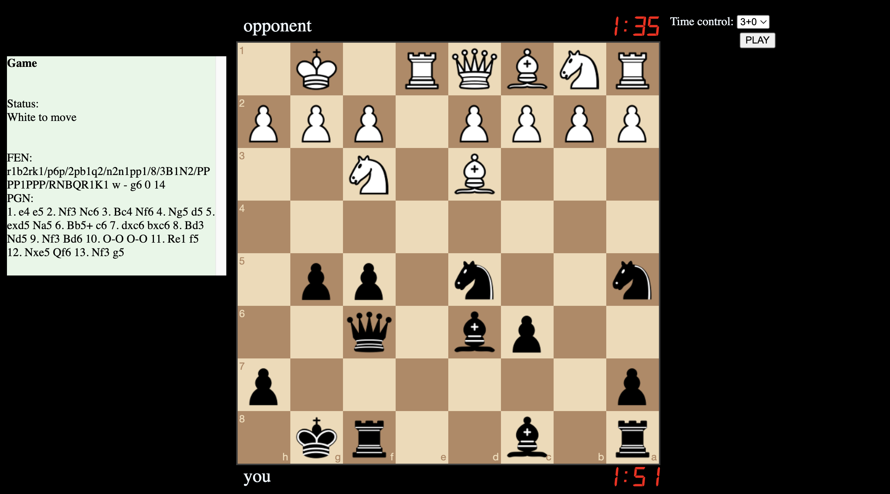

# Chess Application

This is a real-time multiplayer chess application with a built-in clock, implemented using Node.js, Express, and Socket.IO. It allows users to play chess against each other with different time controls and increments.

## Features

- Real-time multiplayer chess
- Different time controls (e.g., 1+0, 3+0, 5+0, 1+1, 3+2)
- Automatic handling of chess rules, including legal moves and game end conditions (checkmate, stalemate, etc.)
- Display of game status, FEN, and PGN
- Dark and light mode switch

## Setup

### Prerequisites

- Node.js
- npm

### Installation

1. Clone the repository:
   ```bash
   git clone https://github.com/jc8352/chess-web-application.git
   cd chess-web-application
   ```

2. Install the dependencies:
   ```
   npm install
   ```

### Running the Application

1. Start the server:
   ```
   node app.js
   ```

2. Open your browser and navigate to `http://localhost:3000`

### Usage

1. Select the desire time control from the dropdown menu.
2. Click the "PLAY" button to start a new game.
3. Wait for another player to join, or start playing if an opponent is already available.
4. The game status, FEN, and PGN will be displayed on the left side of the screen.
5. Use the dark and light mode toggle at the top to switch themes.



### Online Version
You can play the game online at https://thechessgame.azurewebsites.net/

### Notes
- For simplicity, the time control of each game is the time control that is specified by the player that issues the game request first.
- The player that issues the game request first is white

### Potential Improvements
- Syncing the game clocks with the server on each move to account for network delays
- Improving the user interface
- Storing games in a database
